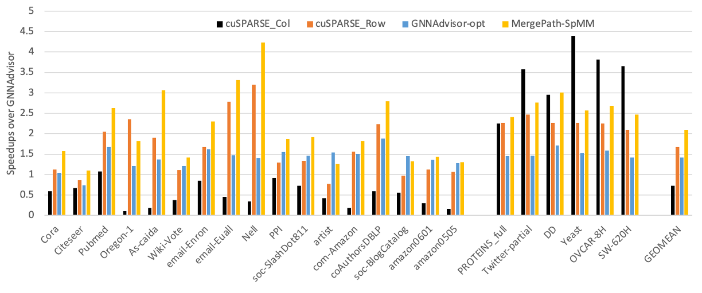

# MergePath-SpMM

Parallel Sparse Matrix-Matrix Algorithm for Graph Neural Network Acceleration

# Citation
@INPROCEEDINGS{10158225,
  author={Shan, Mohsin and Gurevin, Deniz and Nye, Jared and Ding, Caiwen and Khan, Omer},
  booktitle={2023 IEEE International Symposium on Performance Analysis of Systems and Software (ISPASS)}, 
  title={MergePath-SpMM: Parallel Sparse Matrix-Matrix Algorithm for Graph Neural Network Acceleration}, 
  year={2023},
  volume={},
  number={},
  pages={145-156},
  doi={10.1109/ISPASS57527.2023.00023}}

# Requirements
CuSPARSE 10 or higer.

# Datasets
Use the following commands to download and extract datasets
```
wget --no-check-certificate 'https://drive.google.com/uc?export=download&id=1SF8rfz66qJ-b0MT5v5qWuxNJpydb3_hj' -O datasets.tar
tar -xvf datasets.tar
```

# Compilation
Use the following command to build all the kernels.
```
make all
```
To build a specific kernel (row_wise, nz_splitting, mergepath) use following command.
```
make <kernel_name>
```

# Datasets
The script scripts/fetch_dataset.py can be used to download any dataset from the pytorch geometric datasets. It will also convert the data into appropriate format used by the kernels.

# Execution
Use the following command to execute the kernels.
```
nvprof ./<kernel_name> <params>
```
# Additional Results

The figure expands on the experimental data presented in the Figure 4 of the [ISPASS 2023 paper](https://ieeexplore.ieee.org/abstract/document/10158225). All measurements use the standalone kernels in this open-source repository, except the baseline GNNAdvisor uses the version presented in the [OSDI 2021 paper](https://github.com/YukeWang96/GNNAdvisor_OSDI21). All measurements use Cuda compilation tools, release 11.4, V11.4.152. The measurements are reported on an RTX 6000 NVidia GPU using nvprof tool. 

The figure shows normalized speedups of cuSparse using the two dense matrices in the SpMM kernel in both column (cusparse_spmm_col.cu) and row (cusparse_spmm_row.cu) major formats. Moreover, MergePath-SpMM (MergePathSpMM.cu) and GNNAdvisor-opt (nz_splitting.cu) are also evaluated at default dimension size of 16. In cuSPARSE, the dense matrix can be stored in memory using either row-major or column-major arrangement. The paper only shows results using the column-major format. This format demonstrates better performance for structured graphs (Type II graphs in Table II of the ISPASS'23 paper, i.e., PROTEINS_FULL, Twitter-partial, DD, Yeast, OVCAR-8H, and SW-620H) since the column-wise parallelization strategy can be applied, offering substantial data locality. Columns are typically much larger than rows due to the number of nodes in graphs, while the size of rows depends on dimensions. Furthermore, the structured and balanced nature of the sparse input matrix prevents load imbalance in column-wise strategy. However, this format doesn't perform effectively with power-law graphs that experience load imbalance due to the unstructured nature of the graph. For power-law graphs, previous studies have shown that employing a row-wise parallelization strategy yields better results, which is also observed in this evaluation. On average, cuSPARSE with the row-major format outperforms GNNAdvisor as majority of the graphs evaluated are power-law graphs.
